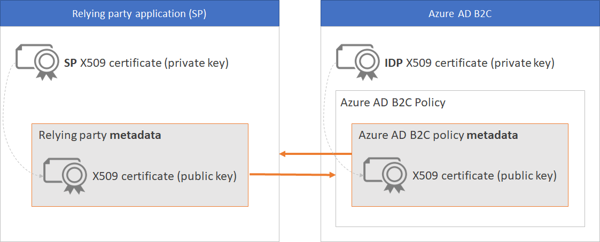
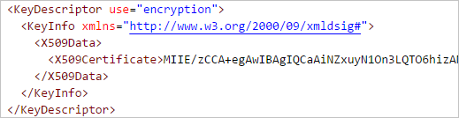

# SAML relying party

Azure AD B2C provides a support for the SAML 2.0 relying party (a.k.a service provider "SP") in private preview. This document outlines the specifics of a technical profile for interacting with relying party application, supporting this standardized protocol. SAML 2.0, as a token format and a protocol, is popular in Java web applications. 

## Important note
**Relying Party support is available as a preview feature.** Support is not available for the general public on this functionality as it has only been tested on some specific modalities. The implementation may be changed in the future without notifying you. Customers should NOT use preview in production environment.

## Technical profile's protocol
The `Name` attribute of the Protocol XML element has to be set to `SAML2` 

## Metadata exchange

Metadata is an information used in the SAML protocol to expose the configuration of a SAML party, like an SP (service provider) and IdP (identity provider). Metadata defines the location of the services, such as sign-in and sign-out, certificates, sign-in method and more. The identity provider uses the metadata to know how to communicate with the service provider (relying party application) and vice versa. The metadata is configured in XML format, and may be signed with digital signature, so the other party can validate the integrity of the metadata.  

The metadata can be configured (in both parties) as "Static Metadata", or "Dynamic Metadata". In static mode, you copy the entire metadata from one party and set it in the other party. In dynamic mode, you set the URL to the metadata, while the other party reads the configuration dynamically. The principle is the same, you set Azure B2C policy's metadata in your service provider (relying party). And set your service provider's metadata in Azure AD B2C.

Each SAML relying party application has different steps to set and read the identity provider metadata. And expose the metadata, so Azure AD B2C can read the metadata. Look at your relying party application’s documentation for guidance on how to do so. You need your relying party applications' metadata URL or XML document to set in Azure AD B2C policy.


Azure AD B2C exposes the metadata in following URL address, replace the:
* **tenant-name** with your tenant name
* **policy-name** with your policy name 

```
https://tenant-name.b2clogin.com/tenant-name.onmicrosoft.com/policy-name/Samlp/metadata
```

## Digital signing certificates exchange
To build a trust between your relying party application and Azure AD B2C, you need to provide valid X509 certificates (with the private key). One certificate with the private key (.pfx file) you store only on your web application. Your relying party application digitally signs the SAML sign-In request using that certificate you provide. Another  certificate with the private key (.pfx file) you store only on Azure AD B2C policy keys. Azure AD B2C digitally signs (or also encrypt) the SAML response using that certificate you provide.  

* The SAML request is sent over to the Azure AD B2C, which validates the SAML request using the same certificate's public key. Relying party public certificate is accessible through your relying party application's profile metadata.

* Azure AD B2C also signs the data send back to the relying party application, using X509 certificate. The relying party application validates the SAML response, using Azure AD B2C policy's public certificate. Each application has different steps to do so, look at your application’s documentation for guidance on how to do so. 

A self-signed certificate is fine for most scenarios. For production environments, we recommend using an X509 certificate that issued by certificate authority. Also as describe later in this document, for none production environment you can disable the SAML signing (on both sides).

Following diagram depicts the metadata and certificate exchange



## Digital singing

Relying party application metadata controls the digital signing:
- **AuthnRequestsSigned** - Indicates whether the SAML request sends by relying party application must be signed. If set to `true`, and the SAML request isn't sign, Azure AD B2C raises an error.
- **WantAssertionsSigned** - Indicates a requirement for the SAML Response Assertion elements received by
the relying party application must be signed. 
 
Following is an example of the relying party metadata `SPSSODescriptor` element:
```XML
<SPSSODescriptor protocolSupportEnumeration="urn:oasis:names:tc:SAML:2.0:protocol" 
    AuthnRequestsSigned="true" WantAssertionsSigned="true">`
```

SAML Response signing is controlled by Azure AD B2C relying party policy's technical profile  `WantsSignedResponses` metadata. For example: 

```XML
<TechnicalProfile Id="PolicyProfile">
  <DisplayName>PolicyProfile</DisplayName>
  <Protocol Name="SAML2" />
  <Metadata>
    <Item Key="WantsSignedResponses">true</Item>
```

## Digital encryption
To encrypt the SAML response assertion, Azure AD B2C always uses the relying party application's public key encryption certificate. When relying party application needs to decrypt the data, it uses the private portion of the encryption certificate to do so.

To encrypt the SAML response assertion, you need to:
1. Provide a valid X509 certificate (with the private key). The certificate with the private key (.pfx file) store and
1. Configure on your web application.
1. Update Azure AD B2C  with the new metadata. Note: you should see the `encryption` section with your certificate public key.

Following is an example of a relying party application's metadata encryption section of the metadata.

 

### Encryption metadata
To encrypt a SAML response (assertion section) send to relying party application, Azure AD B2C:
1. Obtains relying party application's public key.
1. Generates a fresh symmetric key for the data encapsulation scheme. The algorithm used is configured via the  relying party policy metadata `KeyEncryptionMethod`
1. Encrypts the message under the data encapsulation scheme, using the symmetric key generated.
1. Encrypt the symmetric key under the key encapsulation scheme, using relying party application's public key.
1. Issue the SAML token and send both of these encryptions to the relying party application (as part of the SAML response).

 
To decrypt the SAML assertion, the relying party application:
1. Uses her private key to decrypt the symmetric key contained in the key encapsulation segment.
1. Uses this symmetric key to decrypt the message contained in the data encapsulation segment.

## HTTP bindings
Azure AD B2C provides the metadata defines the locations and the bindings of the services, such as sign-in and sign-out endpoints. The relying party application uses this information to initiates the SAML request (sign-in or sign-out). On the other hand, the relying party application provides the metadata defines the locations and bindings to which the SAML tokens are sent (SAML Response). The location is the URL of Azure AD B2C sign-in or sign-out endpoints, and the URL that Azure AD B2C sends the response back to the application, a.k.a redirect URI. The mechanism to transport these messages is called a SAML binding. Azure AD B2C supports following bindings for both, SAML request and SAML response:

- **HTTP-Redirect** - SAML protocol messages are carried directly in the URL query string of an HTTP GET request. Including following query string parameters:
    - SAMLRequest or SAMLResponse - The body of the SAML request/response
    - RelayState (if provided)
    - Signature request/response signature
    - SigAlg - Signature algorithm 

- **HTTP-POST** The SAML messages are transmitted within an HTML form. Including following HTML form parameters:
    - SAMLRequest or SAMLResponse - The body of the SAML request/response
    - RelayState (if provided)
    - The request/response signature and signature algorithm are included in the body of the SAMLRequest or SAMLResponse

## Force Authentication
To force user sign-in, you can pass `ForceAuthn="true"` as an attribute of the `AuthnRequest` element. The specification of `ForceAuthn=true` in the SAML request tells Azure AD B2C that user should force re-authentication, even if a user possesses a valid Azure AD B2C session from previous sign-in. For example:

```XML
<saml2p:AuthnRequest 
    xmlns:saml2p="urn:oasis:names:tc:SAML:2.0:protocol"
    AssertionConsumerServiceURL="http://localhost:8080/spring-security-saml2-sample/saml/SSO" 
    Destination="https://yourtenant.b2clogin.com/yourtenant.onmicrosoft.com/policy/samlp/sso/login" 
    ForceAuthn="true" 
    ID="a39j633j3i41idgf193b2553db7bf38" 
    IsPassive="false" 
    IssueInstant="2018-10-15T06:56:40.521Z" 
    ProtocolBinding="urn:oasis:names:tc:SAML:2.0:bindings:HTTP-POST" Version="2.0">
```

##  IDP Initiated flow

> IDP initiated flow is NOT supported yet!

~~In ISP (identity provider) initiated SSO (Unsolicited request) the sign-in process is initiated by the IDP (Azure AD B2C), sending an unsolicited SAML Response to the SP (relying party application). In this flow, the user does not go through the web app first, rather is directed to the IDP (Azure AD B2C). So the first thing the user sees is the authentication page of Azure AD B2C. User completes the sign-in, redirect to relying party application with SAML response contains the assertions.~~ 

~~Policy requirements:~~
* ~~First orchestration step MUST be a single claims exchange pointing to a SAML technical profile~~
* ~~The Azure AD B2C relying party policy MUST have metadata item `IdpInitiatedProfileEnabled` set to `true`.~~
* ~~The relying party policy MUST be a SAML relying party~~

~~The link to Azure AD B2C SAML relying party policy login URL, replace~~
* ~~**tenant-name** with your tenant name~~
* ~~**policy-name** with your policy name~~

```
https://tenant-name.b2clogin.com/tenant-name.onmicrosoft.com/policy-name/generic/login
```

## Sign-out
When you want to sign the user out of the app, it is not enough to clear your app's cookies or otherwise end the session with the user. You must also redirect the user to Azure AD to sign out. If you fail to do so, the user might be able to re-authenticate to your app without entering their credentials again. This is because they will have a valid single sign-on session with Azure AD.

To sign-out, you use the `<SingleLogoutService>` Location with the preferred binding.

```XML
<SingleLogoutService Binding="urn:oasis:names:tc:SAML:2.0:bindings:HTTP-POST" Location="https://tenant-name.b2clogin.com/tenant-name.onmicrosoft.com/policy-name/samlp/sso/logout"/>
<SingleLogoutService Binding="urn:oasis:names:tc:SAML:2.0:bindings:HTTP-Redirect" Location="https://tenant-name.b2clogin.com/tenant-name.onmicrosoft.com/policy-name/samlp/sso/logout"/>
```

Notes: 
- If the session is set at tenant level `<SingleSignOn Scope="Tenant" />`, Azure AD B2C session is shared across multiple applications, using OpenId connect and SAML protocols.  In this case, sign-out from SAML relying party application means sign-out also from OpenId connect applications. 
- Although directing the user to the sign-out endpoint will clear some of the user's single sign-on state with Azure AD B2C, it will not sign the user out of their social identity provider (IDP) session, such as Facebook. If the user selects the same IDP during a subsequent sign-in, they will be re-authenticated, without entering their credentials. If a user wants to sign out of your B2C application, it does not necessarily mean they want to sign out of their Facebook account. However, in the case of local accounts, the user's session will be ended properly.

## Technical profile's metadata
|Attribute  |Required| Description  |
|---------|---------|---------|
|PartnerEntity |true |URL of the relying party application's metadata. Or use static metadata. Copy the relying party application's metadata, and add the metadata inside XML CDATA element `<![CDATA[Your IDP metadata]]>` |
|XmlSignatureAlgorithm |false |Specifies the method Azure AD B2C uses to sign the SAML response and assertion.<ul><li>Controls the value of SAML request `SigAlg` parameter (query string or post parameter) </li><li>A single value of Sha256, Sha384, Sha512, or Sha1</li><li>Make sure you configure the signature algorithm on both sides with same value</li><li>Use only algorithm your certificate supports</li></ul> | 
|WantsSignedResponses |false |<ul><li>Takes a value of `true` or `false` (default true). </li><li>Setting this to `false` means that the Azure AD B2C shouldn’t sign the SAML response `<samlp:Response>` element. </li><li> If `true`, indicates that SAML response sent by Azure AD B2C to Azure AD B2C is signed, and must be validate by relying party application.</li></ul> | 
|KeyEncryptionMethod |false |Sets the key encryption method to use for `<EncryptedKey>`. One of the values: `Aes128`, `Aes192`, or `Aes256` |
|DataEncryptionMethod|false|Sets the key encryption method to use for `<EncryptedData>` and `<CipherData>`. One of the values: `Rsa15` or `RsaOaep` |
|RemoveMillisecondsFromDateTime|false | Setting the value to true, Azure AD B2C removes the milliseconds from date and time elements, such as `IssueInstant`, `NotOnOrAfter`, and `NotBefore` 
## SAML Issuer
To support SAML relying party, your policy needs to issue SAML token, instead of JTW. Following technical profile issues and manage SAML token and SAML SSO session. 

1. Upload Certs- These are the certificates used to sign the SAML response.
    1. Go to your Azure AD B2C tenant. Click Settings > Identity Experience Framework > Policy Keys.
    1. Click +Add, and then click Options > Upload.
    1. Enter a Name (for example, YourAppNameSamlCert). The prefix B2C_1A_ is automatically added to the name of your key.
    1. Upload your certificate using the upload file control.
    1. Enter the certificate's password.
    1. Click Create.
1. Add following technical profiles to the 'Token Issuer' claims provider. Update {tenant-name} to your tenant name, and {polci} to your relying party policy name.

```xml
<TechnicalProfile Id="Saml2AssertionIssuer">
  <DisplayName>Token Issuer</DisplayName>
  <Protocol Name="None"/>
  <OutputTokenFormat>SAML2</OutputTokenFormat>
  <Metadata>
    <Item Key="IssuerUri">https://login.microsoftonline.com/te/{tenant-name}/{policy}</Item>
  </Metadata>
  <CryptographicKeys>
    <Key Id="SamlAssertionSigning" StorageReferenceId="YourAppNameSamlCert" />
    <Key Id="SamlMessageSigning" StorageReferenceId="YourAppNameSamlCert "/>
  </CryptographicKeys>
  <InputClaims/>
  <OutputClaims/>
  <UseTechnicalProfileForSessionManagement ReferenceId="SM-Saml" />  
</TechnicalProfile>

<TechnicalProfile Id="SM-Saml">
  <DisplayName>Session Management Provider</DisplayName>
  <Protocol Name="Proprietary" 
          Handler="Web.TPEngine.SSO.SamlSSOSessionProvider, Web.TPEngine,
          Version=1.0.0.0, Culture=neutral, PublicKeyToken=null" />
</TechnicalProfile>
```

### SAML Issuer technical profile's Protocol
The `Name` attribute of the Protocol XML element has to be set to `None`. The `OutputTokenFormat` should set to `SAML2`.

```XML
<TechnicalProfile Id="Saml2AssertionIssuer">
    <DisplayName>Token Issuer</DisplayName>
    <Protocol Name="None" />
    <OutputTokenFormat>SAML2</OutputTokenFormat>
```

### SAML Issuer technical profile's metadata
|Attribute  |Required| Description  |
|---------|---------|---------|
|IssuerUri |true |`https://login.microsoftonline.com/te/{tenant-name}/{policy}`. Replace {**yourtenant**} with your tenant name, and {**policy-name**} with your policy name. |

### SAML Issuer technical profile's Cryptographic keys
The following key may be present in the CryptographicKeys XML element:

|Attribute  | Description  |
|---------|---------|
|MetadataSigning |Specify the X509 certificate (RSA key set) to use to sign SAML metadata. Azure AD B2C uses this key to signing the metadata  |
SamlMessageSigning |Specify the X509 certificate (RSA key set) to use to sign SAML messages. Azure AD B2C uses this key to signing the response's `<samlp:Response>` send to the relying party.|
|~~SamlAssertionSigning~~  |~~Specify the X509 certificate (RSA key set) to use to sign the SAML response's assertion. Azure AD B2C uses this key to signing the response'~~ `<saml:Assertion>` ~~part send to the relying party.~~  |

The user journey orchestration step, needs to call `Saml2AssertionIssuer` instead of the `JwtIssuer`. Usually it's the last orchestration step in the user journey element.

``` XML
<!--<OrchestrationStep Order="7" Type="SendClaims" CpimIssuerTechnicalProfileReferenceId="JwtIssuer" />-->
<OrchestrationStep Order="7" Type="SendClaims" CpimIssuerTechnicalProfileReferenceId="Saml2AssertionIssuer" />
```


