# Adding Azure AD B2C as Claims provider to ADFS

## Important note
This solution is based on Azure AD B2C SAML relying party policy. **SAML Relying Party support is available as a preview feature.** Support is not available for the general public on this functionality as it has only been tested on some specific modalities. The implementation may be changed in the future without notifying you. Customers should NOT use preview features in a production environment.

## Introduction 
In the AD FS Management snap-in, *Claims Provider Trusts* are trust between your organization with any partner identity provider, that represents an organization user/identity store. For example, your organization **Contoso** is a partner with **Fabrikam**. So, you want to allow Fabrikam employees to access one of your relying party applications. To do so, you build a *Claims Provider Trust* between your AD-FS and Fabrikam identity provider. After your build the *Claims Provider Trust*, users from Fabrikam can sign-in with their Fabrikam account into your application. This document guides you how to build a *Claims Provider Trust* with your Azure AD B2C tenant (over SAML protocol).

### Solution parties
The solution involves following parties: Relaying party applications that are federated with the AD-FS. AD-FS is your identity provider, allowing your employees to sign-in to your relying party application. AD-FS is also federated with your Azure AD B2C tenant, allowing your consumers to sign-up or sign-in. In Azure AD B2C users can sign-up or sign-in with any arbitrary email address (for example, joe@comcast.net, bob@gmail.com, sarah@contoso.com, or jim@live.com). This type of account is a local account. Or with social accounts, such as Facebook, Microsoft, LinkedIn, Amazon etc.

 Following diagram illustrates the relationship between your application, AD-FS, and Azure AD B2C

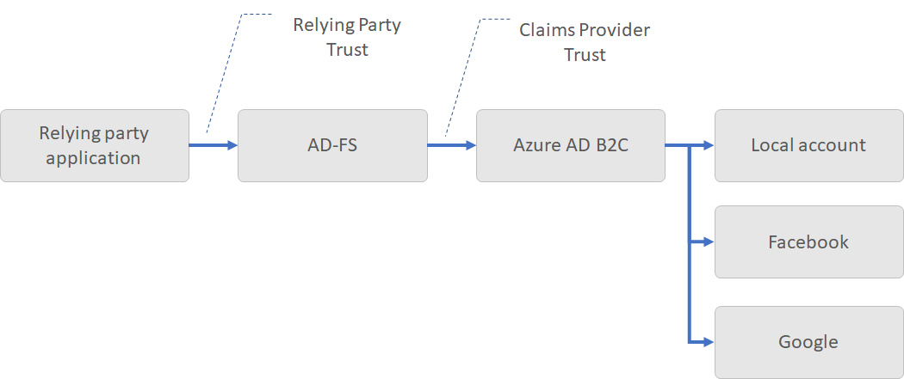

On the relying application, user clicks on sign-in. The relying party application sends authorization request to AD-FS. On the AD-FS side, the user can sign-in as employee (Active Directory account), or as consumer, by selecting the sign-in with Azure AD B2C button. Note: you can change the title.

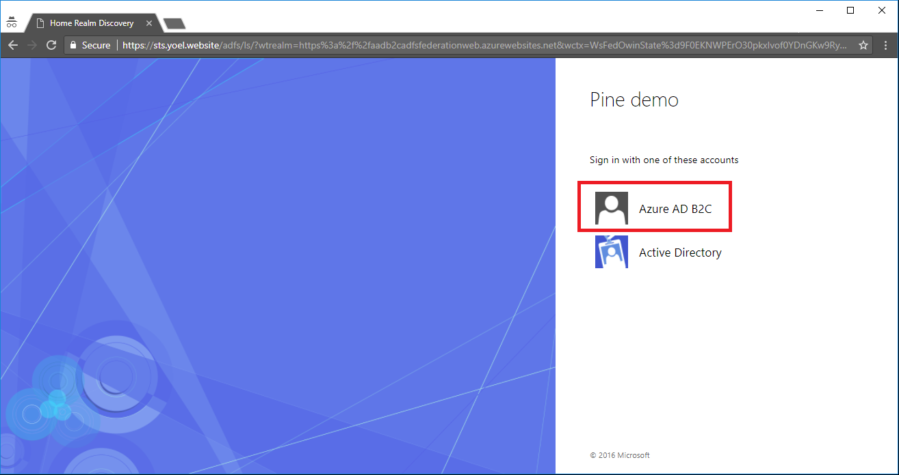

When user clicks on the sign-in with Azure AD B2C, AD-FS initiates SAML request to Azure AD B2C. So, from SAML protocol perspective, AS-FS is now acts as service provider (relying party application), while Azure AD B2C is the identity provider.

### SAML relying party policy and metadata exchange
To build the *Claims Provider Trust* between AD-FS and Azure AD B2C, you need:

- Create Azure AD B2C SAML RP (relying party) policy
- Exchange SAML metadata with AD-FS. Metadata is an information used in the SAML protocol to expose the configuration of a SAML party, like an SP (service provider) and IdP (identity provider). Metadata defines the location of the services, such as sign-in and sign-out, certificates, sign-in method and more. The identity provider uses the metadata to know how to communicate with the service provider (relying party application) and vice versa. The metadata is configured in XML format, and may be signed with digital signature, so the other party can validate the integrity of the metadata.

## 1. Create Azure AD B2C RP policy

> Read the [Configure SAML Relying party application](../../) before you configure your AD-FS trusted claims provider.

Follow the steps [how to create a custom SAML RP policy](../../).  In step #3 **PartnerEntity** to AD-FS's metadata URI. 

AD-FS metadata contains the SAML Identity provider metadata. Also the SAML Service provider metadata. So, you can point Azure AD SAML RP policy to the AD-FS metadata. Azure AD B2C reads the service provider metadata, and ignores the identity provider metadata.

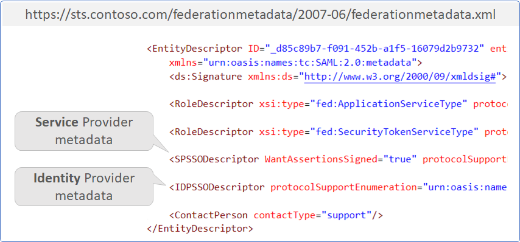

You relying party policy technical profile should look like following. Replace the value of `PartnerEntity` element with your AD-FS metadata.

```XML
<TechnicalProfile Id="PolicyProfile">
    <DisplayName>PolicyProfile</DisplayName>
    <Protocol Name="SAML2" />
    <Metadata>
    <Item Key="PartnerEntity">https://sts.contoso.con/federationmetadata/2007-06/federationmetadata.xml</Item>
    </Metadata>
    <OutputClaims>
    <OutputClaim ClaimTypeReferenceId="displayName" />
    <OutputClaim ClaimTypeReferenceId="givenName" />
    <OutputClaim ClaimTypeReferenceId="surname" />
    <OutputClaim ClaimTypeReferenceId="email" DefaultValue="" />
    <OutputClaim ClaimTypeReferenceId="identityProvider" DefaultValue="" />
    <OutputClaim ClaimTypeReferenceId="objectId" PartnerClaimType="objectId" />
    </OutputClaims>
    <SubjectNamingInfo ClaimType="objectId" ExcludeAsClaim="true" />
</TechnicalProfile>
```

## 2. Create Claims Provider Trust
To add a new claims provider trust, using the AD FS Management snap-in, by automatically importing Azure AD B2C SAML RP policy metadata.

1.  In Server Manager, click **Tools**, and then select **AD FS Management**.  
  
1.  Under **Actions**, click **Add Relying Party Trust**.  

    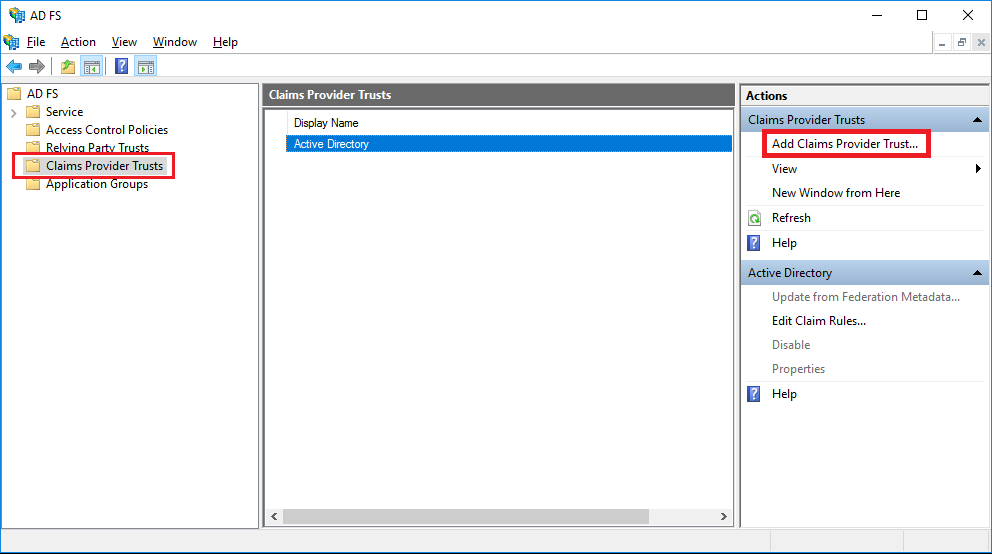   
  
1.  On the **Welcome** page, click **Start**. 
  
1.  On the **Select Data Source** page, click **Import data about the claims provider published online or on a local network**. In Federation metadata address (host name or URL), type the address of Azuer AD B2C SAML policy metadata URI, and then click **Next**.

    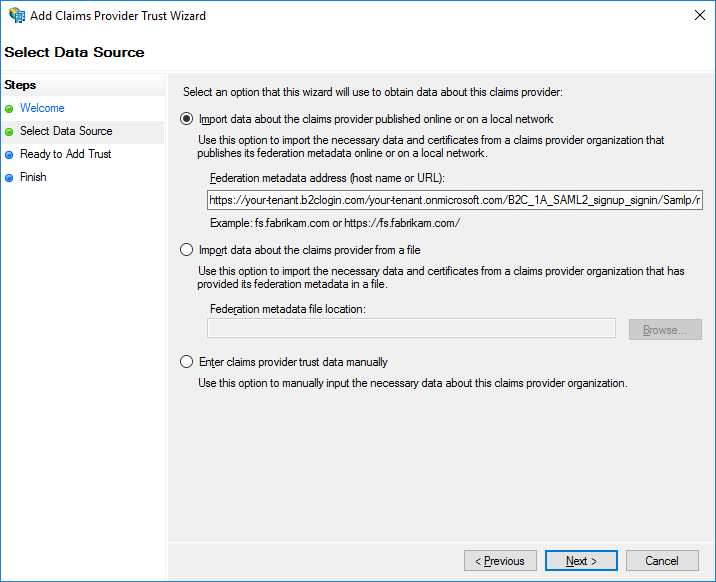    


    The Azure AD B2C policy metadata is available in following URL address, replace the:
    * **tenant-name** with your tenant name
    * **policy-name** with your policy name 
    
    ```
    https://tenant-name.b2clogin.com/tenant-name.onmicrosoft.com/policy-name/Samlp/metadata
    ```
    

1.  On the Specify Display Name page type a **Display name**, under Notes type a description for this claims provider trust, and then click **Next**.

1.  On the Ready to Add Trust page, click **Next** to save your claims provider trust information.

1.  On the Finish page, click **Close**. This will automatically display the Edit Claim Rules dialog box. 

## 3. Create a Rule to Send Claims Using a Custom Rule
  
1.  In Server Manager, click **Tools**, and then select **AD FS Management**.  
  
1.  In the console tree, under **AD FS**, click **Claims Provider Trusts**. 
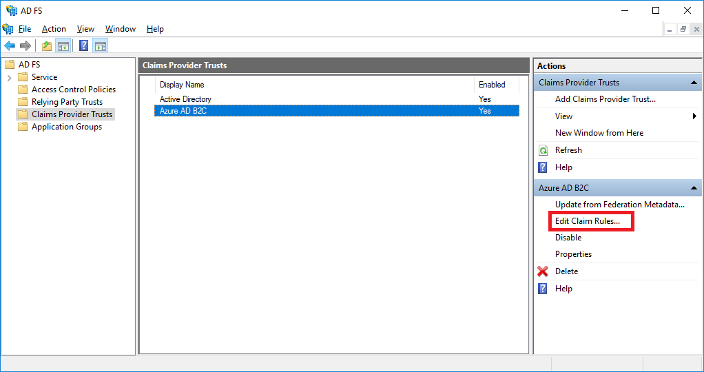  
  
1.  Right\-click the selected trust, and then click **Edit Claim Rules**.
  
1.  In the **Edit Claim Rules** dialog box, under **Acceptance Transform Rules** click **Add Rule** to start the rule wizard.

1.  On the **Select Rule Template** page, under **Claim rule template**, select **Send Claims Using a Custom Rule** from the list, and then click **Next**.  
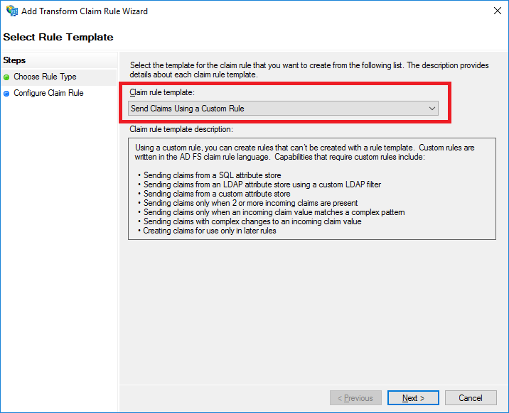   
  
1.  On the **Configure Rule** page, under **Claim rule name**, type the display name for this rule. Under **Custom rule**, type or paste the claim rule language syntax that you want for this rule. To transfer all Azure AD B2C claims, use following syntax:

    ```
    c:[]
      => issue(claim = c);
    ``` 

    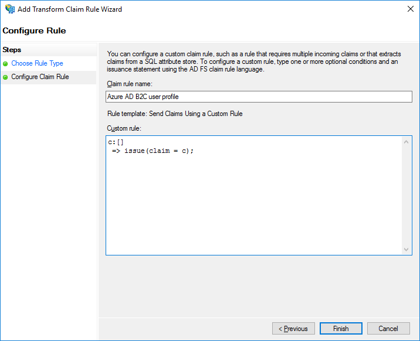     

1.  Click **Finish**.  
  
1.  In the **Edit Claim Rules** dialog box, click **OK** to save the rule. 

## 4. Test your application
Now, when user clicks in the relying party application on sign-in button. The user is redirected to AD-FS sign-in page. The sign-in page should contain the sign-in with Azure AD B2C button. 


When user clicks on the sign-in with Azure AD B2C button, the user is redirected to Azure AD B2C sign-up or sign-in page. Following screenshot demonstrates the AD-FS sign-in page with the Azure AD B2C sign-in option.


## Handling changes on Azure AD B2C policy configuration 
Important: when you change the policy claims or any other metadata that influence the AD-FS, you should update the Claim provider trust

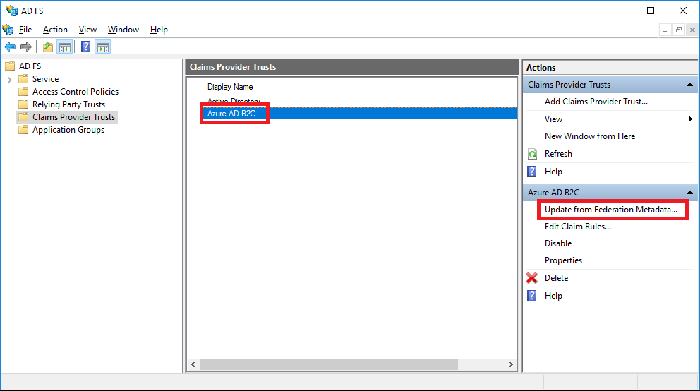

And click on update

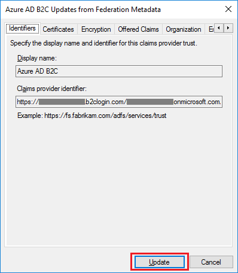


## AD FS Troubleshooting

The AD-FS admin log provides high-level information on issues that are occurring and is enabled by default. To view the admin log:
1.  Open Event Viewer
1.  Expand **Applications and Services Log**.
1.  Expand **AD FS**.
1.  Click on **Admin**.

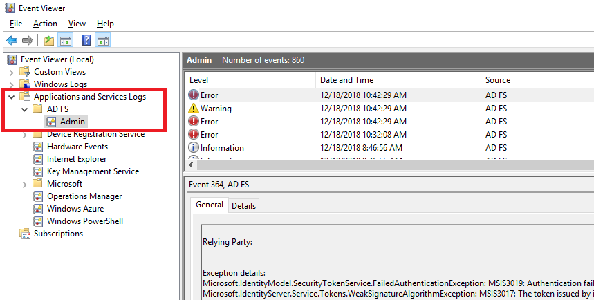