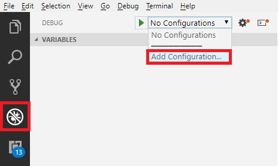

# Securing a Node.js express web application with  Azure AD B2C using SAML 2.0 protocol

This solution demonstrates how to integrate [Node.js](https://nodejs.org/en/) [express](https://expressjs.com/) application with Azure AD B2C, using SAML protocol. The solution is based on the [saml2-js package](https://www.npmjs.com/package/saml2-js). 

> Read the [Configure SAML Relying party application](../../) before you configure your relying party application.

## Important note
This solution is based on Azure AD B2C SAML relying party policy. **SAML Relying Party support is available as a preview feature.** Support is not available for the general public on this functionality as it has only been tested on some specific modalities. The implementation may be changed in the future without notifying you. Customers should NOT use preview features in a production environment.

## 1. Setup Node.js project
1. Installed [Node.js](https://nodejs.org/). If you aleardy install Node.js move to the next step

1. Create a working directory to hold your application

1. Open your working folder with VS Code

1. Open [VS Code terminal](https://code.visualstudio.com/docs/editor/integrated-terminal). Run the `npm init` command. This command creates a [package.json](package.json) file for your application. The command prompts you to provide some information regarding your application, such as the name and version of your application. Accept all the default values. Make sure the **entry point** is set to `index.js`. 

1. Install following NPM packages: [express](https://www.npmjs.com/package/express) and [body-parser](https://www.npmjs.com/package/body-parser)
    ```
    npm install express --save
    npm install body-parser
    ```

1. Install the [saml2-js package](https://www.npmjs.com/package/saml2-js)
    ```
    npm install saml2-js --save
    ```

1. Install the [express-session package](https://www.npmjs.com/package/express-session)
    ```
    npm install express-session --save
    ```
    After running the above commands, your package.json file should look like similar to following:

    ```JS
    {
      "name": "saml-sample-app",
      "version": "1.0.0",
      "description": "",
      "main": "index.js",
      "scripts": {
        "test": "echo \"Error: no test specified\" && exit 1"
      },
      "author": "Your name",
      "license": "ISC",
      "dependencies": {
        "body-parser": "^1.18.3",
        "express": "^4.16.4",
        "express-session": "^1.15.6",
        "saml2-js": "^2.0.3"
      }
    }
    ```

1. Add index.js file and add following lines. This app starts a server and listens on port 3000 for connections. The app responds with “Hello World!” for requests to the root URL (/) or route. For every other path, it will respond with a 404 Not Found.

    ```JS
    const express = require('express')
    const app = express()
    const port = 3000
    
    app.get('/', (req, res) => res.send('Hello World!'))
    
    app.listen(port, () => console.log(`Example app listening on port ${port}!`))
    ``` 
1. To run your Node.js app using VS Code debugger, click on **Debug** and from the menu select **Add Configuration** and click **Run**

    

1. Before you configure your solution and use it with Azure AD B2C, try to run your project. Run you solution and navigate the to http://localhost:3000 to make sure your Node.js app is up and running propertly.

## 2. Secure your application with Azure AD B2C using SAML protocol

Replace the entire content of the index.js you created with the sample [index.js](index.js) file.

### 2.1 Configure the service provider metadata
Metadata is an information used in the SAML protocol to expose the configuration of a SAML party, like an SP (service provider) and IdP (identity provider). Metadata defines the location of the services, such as sign-in and sign-out, certificates, sign-in method and more. The identity provider uses the metadata to know how to communicate with the service provider (relying party application) and vice versa. The metadata is configured in XML format, and may be signed with digital signature, so the other party can validate the integrity of the metadata.

Your application provides the metadata under the http://localhost:3000/saml/metadata. You should copy the service provider metadata and paste it in your Azure AD B2C relying party policy. For more information, see [Configure SAML Relaying party application](https://github.com/yoelhor/advance-scenarios/tree/master/policies/saml-relying-party)

In this section, you configure your service provider metadata. Locate the `var sp_options = {` section and replace to the corresponding values:

  - **entity_id** - Unique identifier for the service provider. For example: `https://myapp.com/`
  - **private_key** - (PEM format string) Private key for the service provider. The application uses this key to sign the SAML requests
  - **certificate** -  (PEM format string) - Certificate for the service provider. The public key of the certificate you specify in the **private_key**. Your application exposes the public key in the service provider metadata. So, Azure AD B2C can validate the SAML request your application sends to Azure AD B2C.
  - **assert_endpoint** URL of service provider assert endpoint. Azure AD B2C will redirect the user to this endpoint
  - **allow_unencrypted_assertion** (Boolean) - If true, allows unencrypted assertions. This can also be configured on the IdP or on a per-method basis.

 ### 2.1 Configure the identity provider metadata
You need manually provide the Azure AD B2C, so the application (serive provider) can interact with. Azure AD B2C provides the metadata in following URL address, replace the:
* **tenant-name** with your tenant name
* **policy-name** with your policy name 

    ```
    https://tenant-name.b2clogin.com/tenant-name.onmicrosoft.com/policy-name/Samlp/metadata
    ```

Locate the `var idp_options = {` section and replace with the values you copy from Azure AD B2C policy metadata.

- **sso_login_url** - Log in url to use during a login request. From your Azure AD B2C metadata copy, the `Location` of the `SingleSignOnService` element
- **sso_logout_url**. Log out url to use during a sign out request. From your Azure AD B2C metadata copy, the `Location` of the `SingleLogoutService` element
- **certificates** - (PEM format string or array of PEM format strings) - Certificate or certificates. You should copy the certificate from Azure AD B2C. 
1. Go to the metadata URL specified above.
1. Copy the value in the <X509Certificate> element
1. Paste it into a text file
1. Save the text file as a .cer file 


## Known issue
Before you copy the service provide metadata to Azure AD B2C policy. Make sure that both `AssertionConsumerService` and `SingleLogoutService` and set to `HTTP-POST`. For example:

```XML
<md:SingleLogoutService Binding="urn:oasis:names:tc:SAML:2.0:bindings:HTTP-POST" Location="http://localhost:3000/saml/assert"/>`
```
    
## Solution artifacts

- [index.js](app.js) The Node.Js code providing the SAML authentication functionality
- [package.json](package.json) Lists the packages that the project depends on
- [policy-files](policy-files) Contains the solution's policy files

This solution comes with following certificates under the **certificates** folder:
- **sp-cert-private.pfx** A self-sign certificate with the private key.
- **sp-cert-public.crt** A self-sign certificate with the public key.
- **idp-cert-public.crt** Azure AD B2C certificate. As mentioned copy the value of the certificate from Azure AD B2C policy metadata.
- **idp-cert-public.pfx** Azure AD B2C certificate with the private key. You can use upload this certificate to Azure AD B2C policy key (password: 1). 


